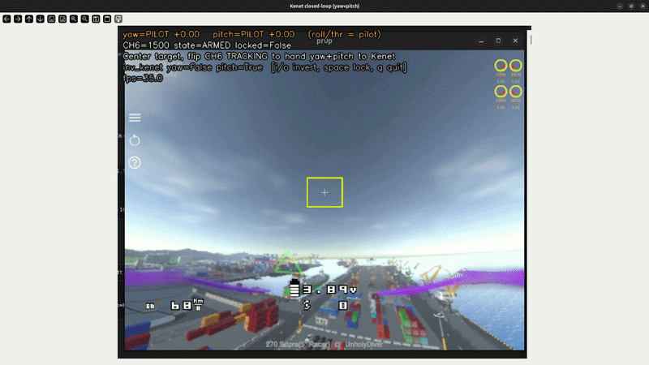

# Kenet



Visual target tracking + PID control + Betaflight MSP for FPV drones.

A camera feeds an OpenCV tracker, a PID controller turns the target's position
into yaw and pitch commands, and those commands go to a Betaflight flight
controller over MSP. Telemetry is sent to a ground station over UDP. It runs on a
companion board (Raspberry Pi / Jetson) next to the flight controller, and the
whole thing can also be tested on a PC with no hardware.

## Architecture

```
Camera -> CameraCapture (threaded) -> ObjectTracker (CSRT/KCF)
    -> FlightController (PID: yaw + pitch) -> MSP_SET_RAW_RC -> Betaflight FC
    -> GCSLink (UDP telemetry) -> Ground station
```

A single 3-position AUX switch drives the state machine: IDLE (pilot flies),
AI-ARMED (camera ready, pilot still flies), TRACKING (Kenet takes over pitch and
yaw through MSP Override).

## Project structure

```
kenet/
  __init__.py    - Package exports
  camera.py      - Threaded OpenCV video capture
  tracker.py     - CSRT / KCF object tracking (needs opencv-contrib)
  controller.py  - PID controllers + rate-limited flight control
  msp.py         - MSPv1 serial protocol for Betaflight
  gcs.py         - UDP telemetry to the ground station
  joystick.py    - Desk-test AUX input from a USB joystick (no FC)
  pipeline.py    - 3-position state machine + control loop
kenet.py         - CLI entry point
quick_gcs.py     - Minimal telemetry viewer
tools/           - Betaflight SITL RC bridge, probe, and switch monitors
tests/           - Unit tests (pytest)
```

## Install

```bash
python -m venv fpv_env
source fpv_env/bin/activate
pip install -r requirements.txt
```

`requirements.txt` pulls in `opencv-contrib-python`, `pyserial`, and `numpy`.
The contrib build of OpenCV matters: the CSRT and KCF trackers only exist there.
Plain `opencv-python` does not have them, and Kenet raises a clear
`TrackerUnavailableError` if it can't create a tracker.

For development and tests:

```bash
pip install -r requirements-dev.txt
fpv_env/bin/python -m pytest
```

Run commands in this README from an activated `fpv_env` shell. If the
environment is not active, use `fpv_env/bin/python ...` instead of bare
`python ...`; this avoids accidentally using another project's interpreter.

---

## How to run

There are three ways to run Kenet, depending on what hardware you have. All of
them use the same pipeline; only the source of the AUX switch differs.

Portable SITL examples use these optional environment variables:

```bash
export FPV_ROOT="$(pwd)"
export BETAFLIGHT_ROOT="${BETAFLIGHT_ROOT:-../betaflight}"
export AEROLOOP_GAZEBO="${AEROLOOP_GAZEBO:-../aeroloop_gazebo}"
export JOY_DEV="${JOY_DEV:-/dev/input/js0}"
```

### 1. With a flight controller (normal use and desk testing)

This is the real setup. Kenet reads the AUX switch from the flight controller
over MSP and, in TRACKING, sends pitch/yaw back to it. You need the FC connected
(over USB for desk testing, or a UART on a Pi/Jetson) with a real receiver bound
to your transmitter. Close Betaflight Configurator first — it locks the port.

```bash
# Find the FC serial port (USB FC is usually /dev/ttyACM0)
ls /dev/ttyACM*

# Terminal 1 — run the pipeline, send telemetry to this same PC
python kenet.py --port /dev/ttyACM0 --gcs-host 127.0.0.1

# Terminal 2 — watch telemetry
python quick_gcs.py
```

On a companion board the port is typically a UART, e.g.
`python kenet.py --port /dev/ttyAMA0 --gcs-host 192.168.1.100`.

Then flip the 3-position AUX switch and watch the state transitions in the logs
(IDLE → AI-ARMED → TRACKING). See "Betaflight setup" below for the required MSP
Override configuration, and always bench-test with the propellers removed.

### 2. Without a flight controller (joystick mode)

When you plug the transmitter into the PC in USB "game controller" mode it shows
up as a joystick (`$JOY_DEV`, default `/dev/input/js0`), not as an FC. In this mode Kenet reads the
AUX switch straight from the joystick, so you can exercise the state machine, the
camera, and the tracker with no flight controller at all. The MSP override has
nowhere to go (there is no FC), which is expected.

First identify which joystick axis is your 3-position switch — flip it through
all three positions and note the axis that jumps between three values:

```bash
python -m kenet.joystick
```

Then run Kenet in joystick mode. If there is no webcam, use a video file:

```bash
python kenet.py --joystick --camera test-2.mp4 --no-gcs
```

The TBS Joystick defaults are already wired in (mode switch on axis 6, arm switch
on axis 4, autopilot mode switch on axis 5). Use `--joy-axis` and the other
`--joy-*` flags below if your transmitter differs, or `--joy-invert` if a switch
runs backwards. A preview window opens unless you pass `--headless`; if OpenCV
can't open a window it logs a warning and keeps running headless.

### 3. With Betaflight SITL (a real Betaflight on the PC)

Betaflight has a SITL ("software in the loop") build that runs as a normal Linux
program and speaks real MSP. This is the way to test the MSP protocol, MSP
Override, and attitude telemetry against an actual Betaflight without hardware.

Build and run it in a separate workspace:

```bash
git clone https://github.com/betaflight/betaflight "$BETAFLIGHT_ROOT"
cd "$BETAFLIGHT_ROOT"
make TARGET=SITL
./obj/main/betaflight_SITL.elf      # RC input on UDP :9004, MSP on TCP :5761
```

For hands-on FPV flying with no hardware at all — keyboard control, a forward
FPV camera on the drone, and a world populated with people and cars — use:

```bash
./launch-fpv-sim.sh
```

It opens Gazebo's GUI with a docked "FPV Camera" panel (the drone's forward
camera on `/kenet/fpv_camera`), starts Betaflight SITL with the measured SITL
profile, and runs `tools/sitl_keyboard_rc.py` in the terminal: `w/s` throttle,
`a/d` yaw, `i/k` pitch, `j/l` roll, `e` ARM, space = panic disarm, `q`/ESC =
safe exit. Add `--input joystick` to fly with the physical transmitter
instead. See `docs/sitl-quickstart.md` section 7 for details.

For the simplest physical-RC simulation loop, use the single launcher from this
repo root:

```bash
./launch-physical-rc-sim.sh
```

It opens Gazebo, starts Betaflight SITL, applies the measured SITL mode/PID
profile plus a conservative roll/pitch/yaw manual rate profile
(`rc_rate=5`, `rate=30`, `rate_limit=120` per axis), forces CH7/AUX3 to ANGLE
at `1500`, and sends `/dev/input/js0` RC packets to UDP `9004`. Stop it with
Ctrl-C; logs are written as
`logs/sitl/<RUN>-*`. Before sending RC, it waits for throttle-low and ARM-low;
do not arm until the launcher prints `READY`. It also starts the web dashboard
at `http://127.0.0.1:8080` so RC channels, ARM/Kenet/mode state, MSP arming
flags, motors, attitude, logs, and process buttons are visible during the run.
While the dashboard is enabled, diagnostics reuse the dashboard MSP snapshot
instead of opening a competing direct MSP reader.

First prove the RC chain with just the transmitter. Check the mapping, then send
the pilot sticks and switches to SITL:

```bash
python tools/sitl_rc_bridge.py --device "$JOY_DEV" --dry-run
python tools/sitl_rc_bridge.py --device "$JOY_DEV" --send --verbose
```

Confirm Betaflight received it without opening Configurator:

```bash
python tools/sitl_rc_probe.py --device "$JOY_DEV"
```

Then bring Kenet's tracking into the loop with the mixer. It reads the same pilot
RC, runs the tracker on a camera or video, and merges the two: in TRACKING with a
target it replaces pitch and yaw with Kenet's output and leaves roll, throttle,
and the AUX channels with the pilot; in IDLE/AI-ARMED, with no target, or if the
tracker can't load, everything passes through from the pilot. It sends one merged
packet to SITL and does not use MSP override. In `--send` mode, shutdown sends a
throttle-low centered safe-exit RC frame, and send stalls over 2x the nominal loop
period are logged as watchdog warnings.

```bash
# Dry-run: print pilot vs. merged channels without sending
python tools/kenet_sitl_mixer.py --device "$JOY_DEV" --camera test-2.mp4

# Send the merged RC to SITL
python tools/kenet_sitl_mixer.py --device "$JOY_DEV" --camera test-2.mp4 --send

# No joystick: synthesize pilot RC for repeatable SITL/Gazebo tests
python tools/kenet_sitl_mixer.py --pilot-source virtual --virtual-script takeoff \
  --virtual-throttle 1750 --virtual-kenet-pwm 2000 --virtual-mode-pwm 1500 \
  --no-vision --send

# No camera/video: synthesize a found target and exercise Kenet pitch/yaw output
python tools/kenet_sitl_mixer.py --pilot-source virtual --virtual-script takeoff \
  --virtual-throttle 1750 --virtual-kenet-pwm 2000 --virtual-mode-pwm 1500 \
  --synthetic-target --synthetic-target-delay-seconds 18 --send

# One command: external checker + virtual pilot mixer + centered synthetic target
python tools/sitl_synthetic_tracking_check.py \
  --profile centered --synthetic-target-delay-seconds 0

# No Kenet: direct virtual RC takeoff, then delayed yaw nudge after takeoff
python tools/sitl_virtual_takeoff_check.py \
  --hold-seconds 30 --virtual-rc-timeout 80 \
  --nudge-delay-seconds 18 --nudge-yaw 1504
```

Flip the Kenet state switch (CH6/AUX2 by default) to High and watch pitch and yaw
move in Configurator's Receiver tab while roll and throttle still follow your
sticks. Add `--preview` to see the tracker window.

To configure SITL in Betaflight Configurator, bridge its TCP port to a websocket
(`pip install websockify`, then `websockify 127.0.0.1:6761 127.0.0.1:5761`) and
connect to `ws://127.0.0.1:6761`. The full step-by-step is in `plan-sitl.md`.

Kenet's real MSP path can also talk directly to Betaflight SITL's TCP MSP port:

```bash
python tools/kenet_msp_smoke.py --msp-tcp 127.0.0.1:5761
python tools/kenet_msp_smoke.py --msp-tcp 127.0.0.1:5761 \
  --set-raw-rc 1500,1600,1000,1400,2000,2000,1500,1500
python kenet.py --camera test-2.mp4 --msp-tcp 127.0.0.1:5761 --aux-ch 5 --headless
```

Close Configurator first; SITL's MSP TCP port accepts one client at a time. The
`--set-raw-rc` smoke sends pilot/AETR channels and checks Betaflight's MSP_RC
readback with the shared AETR-to-MSP mapping.

### 4. With Gazebo physics

Gazebo is optional and currently targets Gazebo Harmonic / `gz-sim8`. Keep the
Gazebo assets and Betaflight source outside this repo, then point Kenet's helper
scripts at them:

```bash
export AEROLOOP_GAZEBO="${AEROLOOP_GAZEBO:-../aeroloop_gazebo}"
export BETAFLIGHT_ROOT="${BETAFLIGHT_ROOT:-../betaflight}"
export JOY_DEV="${JOY_DEV:-/dev/input/js0}"

tools/check_sitl_env.sh
tools/run_gazebo_betaflight.sh --world test_betaflight.sdf --headless
```

For the shortest no-hardware retest sequence, use
`docs/sitl-quickstart.md`. For acceptance details and measured log evidence,
use `docs/sitl-acceptance-procedure.md`.
To summarize the current no-hardware evidence and external blockers, run:

```bash
fpv_env/bin/python tools/sitl_readiness_report.py
```

For the Iris demo world, prefer the timing-isolated retest command while the
takeoff flip is being debugged:

```bash
tools/run_gazebo_betaflight.sh \
  --world betaloop_iris_betaflight_demo_harmonic.sdf \
  --headless \
  --max-step-size 0.001

python tools/gazebo_stats_monitor.py --samples 30 --interval 0.5
```

The Gazebo plugin uses UDP `9002` for motor commands and `9003` for simulator
state. RC still enters Betaflight SITL through UDP `9004`. While debugging the
Iris takeoff flip, use virtual RC first so the physical transmitter and joystick
mapping are not part of the failure:

```bash
python tools/sitl_configure_modes.py
python tools/sitl_virtual_rc.py --script takeoff --throttle 1550 --mode-pwm 1500
python tools/sitl_virtual_rc.py --script takeoff --throttle 1550 --mode-pwm 1500 --send
```

The first command applies the SITL mode ranges over MSP/TCP without opening
Configurator: ARM on AUX1 high, MSP Override on AUX2 high, and ANGLE on AUX3
mid (`1300-1700`). The second command is a dry-run. The third sends a boot-low,
arm-low-throttle,
throttle-ramp, takeoff-hold, disarm-low sequence to SITL. Once virtual RC is
clean, the physical RC path can be reintroduced with `sitl_rc_bridge.py` or
`kenet_sitl_mixer.py`. If no joystick is available, `kenet_sitl_mixer.py`
can also use `--pilot-source virtual` to exercise the Kenet mixer path with the
same synthetic takeoff sequence.

For an automated motor-output smoke test:

```bash
python tools/gazebo_sitl_motor_smoke.py
```

The smoke test keeps AUX1 low until Betaflight arming flags clear, raises AUX1
to arm, applies modest throttle, checks `MSP_MOTOR`, and reports Gazebo rotor
joint motion as supporting evidence.

For a live read-only dashboard while Gazebo / Betaflight / Kenet are running:

```bash
python tools/sitl_dashboard.py --open
```

If the transmitter's second 3-position switch is not mapped yet, force CH7/AUX3
for flight-mode testing:

```bash
python tools/sitl_dashboard.py --open --force-mode-pwm 1500
python tools/kenet_sitl_mixer.py --device "$JOY_DEV" --camera test-2.mp4 --send --force-mode-pwm 1500
```

Use this with Betaflight Configurator Modes tab set to ANGLE on `AUX3
1300-1700` for the first Gazebo takeoff / flip diagnosis.

When using virtual RC, diagnostics can compare the expected virtual pilot frame
against Betaflight's `MSP_RC` values:

```bash
python tools/sitl_diagnostics.py --rc-source virtual \
  --virtual-throttle 1550 \
  --virtual-arm-pwm 2000 \
  --virtual-mode-pwm 1500 \
  --samples 20 --interval 0.25
```

For the current Iris flip isolation, also capture the raw motor UDP output that
Betaflight sends on `9001/udp`:

```bash
python tools/sitl_motor_udp_probe.py --duration 30
```

To bypass Betaflight and measure Gazebo BetaflightPlugin motor-to-body moment
signs directly:

```bash
python tools/gazebo_motor_moment_probe.py \
  --base-speed 0.30 --pulse-speed 0.45 \
  --pulse-seconds 0.35 --settle-seconds 0.25
```

For the current regression check, use the end-to-end virtual takeoff runner. It
starts Gazebo and Betaflight, bootstraps the Gazebo plugin handshake, configures
ARM/ANGLE/HORIZON ranges, sends virtual RC, logs pose/IMU diagnostics, and prints
PASS/FAIL:

```bash
python tools/sitl_virtual_takeoff_check.py \
  --throttle 1750 --hold-seconds 8 \
  --diagnostic-samples 75 --diagnostic-interval 0.1
```

For yaw feedback isolation, capture raw motor UDP and optionally change yaw PID
inside the same run. `--zero-yaw-pid` is a diagnostic gate, not a flight
configuration. The runner starts Betaflight in a temp cwd by default so stale
`eeprom.bin` state from the repo root does not leak into acceptance runs; use
`--betaflight-cwd repo` only when intentionally reproducing legacy state:

```bash
python tools/sitl_virtual_takeoff_check.py \
  --capture-motor-udp \
  --nudge-delay-seconds 18 --nudge-yaw 1504 \
  --zero-yaw-pid \
  --hold-seconds 30

python tools/sitl_virtual_takeoff_check.py \
  --capture-motor-udp \
  --nudge-delay-seconds 18 --nudge-yaw 1504 \
  --yaw-pid 45,0,0 \
  --hold-seconds 30

python tools/sitl_virtual_takeoff_check.py \
  --capture-motor-udp \
  --nudge-delay-seconds 18 --nudge-yaw 1504 \
  --yaw-pid 23,0,0 \
  --debug-mode PIDLOOP \
  --hold-seconds 40
```

For the measured Iris SITL safe-yaw acceptance profile, keep the physical RC
isolated and add the explicit rate profile:

```bash
python tools/sitl_virtual_takeoff_check.py \
  --capture-motor-udp \
  --nudge-delay-seconds 18 --nudge-yaw 1504 \
  --yaw-pid 23,0,0 \
  --safe-yaw-authority \
  --debug-mode AC_ERROR \
  --hold-seconds 40
```

`--safe-yaw-authority` applies `yaw_rc_rate=5`, `yaw_rate=30`, and
`yaw_rate_limit=120`. Treat this as a SITL acceptance/debug profile, not a
real-aircraft tune.

`--debug-mode` accepts Betaflight debug names such as `PIDLOOP`,
`ANGLERATE`, `ANGLE_TARGET`, or a numeric mode. When the runner owns
Betaflight, it applies the mode over MSP, saves it, and restarts Betaflight from
the same temp cwd before the virtual takeoff script. This matters because the
Betaflight runtime `debugMode` value is loaded at init. Diagnostics then logs
`msp.debug_mode` and the signed `msp.debug` values in the same JSONL run.
Use `tools/sitl_debug_calibration.py` to check whether a selected debug mode
actually produces nonzero values before trusting it as evidence. Current
calibration: `PIDLOOP` is readable but is Betaflight loop timing, not yaw PID
state; `ANGLERATE` stayed zero in this SITL setup; `ANGLE_TARGET` produces some
Gazebo values, but yaw setpoint slot `debug[2]` stayed zero in the P23/yaw1504
flip run. Treat Blackbox or direct Betaflight instrumentation as the next path
for yaw-internal state.

When RC is supplied by another process, such as `sitl_rc_bridge.py` with a
physical transmitter or `kenet_sitl_mixer.py`, use the same acceptance gate in
observer mode:

```bash
python tools/sitl_virtual_takeoff_check.py \
  --rc-driver external \
  --throttle 1750 \
  --diagnostic-samples 75 --diagnostic-interval 0.1
```

In `external` mode the checker does not send RC. It starts/logs Gazebo and
Betaflight, then expects an external RC sender to arm, select ANGLE, and reach
the target throttle during the diagnostics window.

The dashboard shows Kenet state, ARM command, Betaflight armed status, pilot RC,
FC RC, MSP motor output, attitude, raw axes, and raw buttons. It also has
buttons to start/stop Gazebo, Betaflight SITL, and the Kenet SITL mixer. Close
Betaflight Configurator if MSP fields stay offline; SITL's MSP TCP port accepts
one client at a time. Dashboard-started Betaflight uses a temp cwd by default so
stale repo-root `eeprom.bin` state does not leak in; use `--betaflight-cwd repo`
only when intentionally reproducing legacy state. Process start/stop actions are
limited to loopback clients by default; pass `--allow-remote-control` only when
you intentionally expose that control on the network. Before starting Kenet, the
dashboard checks for existing `sitl_rc_bridge.py`, `sitl_virtual_rc.py`, or
`kenet_sitl_mixer.py --send` processes and refuses to create a duplicate RC
sender.

The dashboard and Kenet mixer write debugging logs under `logs/sitl/` by
default. These logs are ignored by git. Use the dashboard's `Mark Event` button
when a flip, tumble, or other bad behavior starts, then summarize the recent
JSONL logs with:

```bash
python tools/analyze_sitl_log.py
```

Mixer flight logging defaults to 10 Hz, buffered flushes every 10 records or
about 1 second, and rotates at 50 MiB. Use `--flight-log-hz`,
`--flight-log-flush-every`, `--flight-log-flush-seconds`, and
`--flight-log-max-mb` when a run needs different logging behavior.

Shared RC channel indices and AETR-to-MSP RPYT mapping live in
`kenet/rc_channels.py`; `tools/sitl_rc_channels.py` adds SITL labels and neutral
values on top. Keep new tools on those helpers instead of copying channel
metadata locally.

The stable JSONL event contract for dashboard, diagnostics, mixer, virtual RC,
and motor UDP logs is documented in `docs/sitl-jsonl-schema.md`.
The repeatable pre-hardware SITL gates are summarized in
`docs/sitl-acceptance-procedure.md`.

---

## The 3-position AUX state machine

The camera and pipeline start when the program starts. The AUX switch only
controls whether the tracker and MSP override are active.

```
AUX Low              AUX Mid                 AUX High
   IDLE      -->    AI-ARMED      -->       TRACKING
pilot flies        pilot flies          Kenet drives pitch/yaw,
normally           normally             pilot keeps roll/throttle
```

| AUX position    | State        | What happens                              | Who controls the drone        |
|-----------------|--------------|-------------------------------------------|-------------------------------|
| Low (~1000)     | **IDLE**     | Monitors AUX, sends no RC                  | Pilot (real RX)               |
| Mid (~1500)     | **AI-ARMED** | Tracker init zone ready, sends no RC       | Pilot (real RX)               |
| High (~2000)    | **TRACKING** | Tracker + PID active, Kenet sends pitch/yaw| Kenet pitch/yaw, pilot the rest |

When the switch drops below High, Kenet stops sending RC and the real receiver
takes over immediately. This handoff does not rely on triggering failsafe, but a
normal Betaflight receiver/failsafe setup is still required.

---

## Betaflight setup

You need a real RC receiver on the FC for normal flying, plus MSP Override so
Kenet can take over specific channels while tracking.

1. **Ports tab** — enable MSP on the UART connected to your companion board. For
   desk testing over USB, MSP is on by default.

2. **Enable MSP Override (CLI)** — Kenet only drives pitch and yaw, so override
   only those two channels. With the channel order roll=0, pitch=1, throttle=2,
   yaw=3, the bitmask for pitch+yaw is `10`:

   ```
   feature MSP_OVERRIDE
   set msp_override_channels = 10
   save
   ```

   Do not use `15` — that would also freeze the pilot's roll and throttle at
   center during tracking. The current Kenet contract is pitch/yaw-only; adding
   throttle or roll authority is a separate design change and must not be done
   by simply widening this mask.

3. **Modes tab** — assign MSP OVERRIDE to the High range of the same 3-position
   AUX switch you use for TRACKING, and set up ANGLE mode as appropriate for your
   airframe.

### Bench safety checklist

Before any powered test with a flight controller:

1. Remove the propellers.
2. Verify `get msp_override_channels` reports `10`.
3. In TRACKING, confirm pitch/yaw move from Kenet while roll/throttle still
   follow the transmitter.
4. Drop AUX below High and confirm MSP Override stops immediately.
5. Save the Betaflight `diff all` output for the test setup.

---

## Control scheme

- **Yaw** — horizontal pixel error turns the drone to face the target.
- **Pitch** — target bounding-box width vs. the desired width flies
  forward/backward to hold distance.
- **Roll and throttle** — not driven by Kenet with the recommended override mask;
  the pilot keeps them.
- A rate limiter smooths channel changes so attitude can't jump suddenly.

PID tuning, the usual way: set `ki=0, kd=0` and raise `kp` until it follows but
oscillates, add `kd` to damp the oscillation, then a little `ki` to remove
steady-state offset.

---

## CLI reference

### kenet.py

```
--port            FC serial port (default: /dev/ttyAMA0; USB FC is often /dev/ttyACM0)
--msp-tcp         Betaflight SITL MSP TCP endpoint, e.g. 127.0.0.1:5761
--camera          Camera index (0,1,...) or video file path (default: 0)
--tracker         Tracker type: CSRT or KCF (default: CSRT)
--aux-ch          3-position AUX channel, 0-indexed (default: 5 / CH6 / AUX2)
--track-size      Tracker init bbox size in pixels (default: 100)
--loop-hz         Control loop frequency (default: 30)
--headless        Disable the GUI preview window
--gcs-host        GCS IP address (default: 192.168.1.100)
--gcs-port        GCS telemetry port (default: 14550)
--no-gcs          Disable GCS telemetry

Joystick mode (test without a flight controller):
--joystick            Read AUX from a USB joystick instead of MSP/FC
--joy-device          Joystick device (default: /dev/input/js0)
--joy-axis            Axis of the 3-position mode switch -> Kenet state (default: 6)
--joy-invert          Invert the mode axis
--joy-arm-axis        Axis of the 2-position arm switch (default: 4; -1 to disable)
--joy-arm-ch          RC channel for the arm switch (default: 4 / CH5)
--joy-arm-invert      Invert the arm axis
--joy-ap-mode-axis    Axis of the autopilot 3-position mode switch (default: 5; -1 to disable)
--joy-ap-mode-ch      RC channel for the autopilot mode switch (default: 6 / CH7)
--joy-ap-mode-invert  Invert the autopilot mode axis
```

Kenet state default is now `CH6 / AUX2 / index 5` to match the Tango 2 SITL
mapping. Older setups that intentionally used `AUX4 / index 7` should pass
`--aux-ch 7` explicitly.

### quick_gcs.py

```
--port            UDP listen port (default: 14550)
```

### GCS commands

Send a JSON object over UDP to the pipeline's command port (default 14551):

- `stop` — stop the pipeline.
- `set_target_width` with `{"width": 150}` — change the follow distance.
- `ping` — heartbeat.

Example:

```bash
python -c "import socket,json; s=socket.socket(socket.AF_INET,socket.SOCK_DGRAM); \
  s.sendto(json.dumps({'command':'stop'}).encode(),('127.0.0.1',14551))"
```

---

## tools/

Helpers for the SITL path and for mapping your transmitter. The bridge, probe,
and monitors are standard-library only; the mixer also imports Kenet (camera,
tracker, controller), so run it from the project venv.

- `kenet_sitl_mixer.py` — the main Kenet-into-SITL test tool. Reads pilot RC,
  runs the tracker on a camera/video, and sends one merged RC packet to SITL
  (pitch/yaw from Kenet in TRACKING with a target, pilot everywhere else). No
  MSP override. In `--send` mode it sends a throttle-low centered safe-exit frame
  on shutdown and logs RC TX watchdog warnings when send intervals exceed 2x the
  nominal loop period. Use `--pilot-source virtual --virtual-script takeoff` for
  repeatable no-joystick Gazebo checks. Use `--synthetic-target` only for
  deterministic no-camera target-found tests.
- `sitl_mixer_matrix_check.py` — no-hardware P6 matrix checker for the SITL
  mixer contract: AUX2 low/mid/high state behavior, target-lost passthrough,
  target-found pitch/yaw-only override, ARM low/high channel contract, and
  roll/throttle passthrough in TRACKING.
- `sitl_rc_bridge.py` — reads the joystick and sends Betaflight SITL RC packets
  over UDP `:9004` (`--send`), or just prints the mapped channels (`--dry-run`).
  Use `--force-mode-pwm 1500` to hold CH7/AUX3 at MID for ANGLE mode tests.
- `sitl_virtual_rc.py` — sends deterministic synthetic RC packets without a
  joystick. Use it for Gazebo isolation tests, scripted CH3 throttle ramps, and
  repeatable ARM/ANGLE/HORIZON retests. In takeoff mode,
  `--nudge-delay-seconds` plus `--nudge-roll/--nudge-pitch/--nudge-yaw`
  applies a small delayed RC offset after the neutral takeoff phase.
- `sitl_virtual_takeoff_check.py` — end-to-end Gazebo acceptance runner. In
  default virtual mode it sends scripted takeoff RC itself; with
  `--rc-driver external` it only observes RC supplied by `sitl_rc_bridge.py`,
  `kenet_sitl_mixer.py`, or a physical transmitter. The virtual mode also
  exposes delayed nudge options for no-Kenet pitch/yaw isolation. Betaflight
  runs in a temp cwd by default to avoid stale `eeprom.bin` state; opt back into
  repo-root state with `--betaflight-cwd repo`. Use
  `--capture-motor-udp` to collect raw Betaflight motor UDP `:9001` and virtual
  RC JSONL logs during the same check. Gazebo diagnostics can pass temporary
  Iris model overrides such as `--iris-yaw-gyro-scale` and
  `--iris-rotor-vel-p-gain` without editing the source SDF.
- `sitl_motor_udp_probe.py` — captures Betaflight raw motor UDP output,
  remaps logical BF motor values to Gazebo packet slot order, and summarizes
  roll/pitch/yaw axis bias for closed-loop instability analysis.
- `sitl_virtual_rc.py` — sends scripted virtual RC frames to Betaflight SITL;
  `--log-file` writes the transmitted step/frame stream as JSONL.
- `sitl_synthetic_tracking_check.py` — one-command no-joystick/no-camera
  acceptance wrapper for the external checker plus `kenet_sitl_mixer.py
  --pilot-source virtual --synthetic-target`. Use `--profile centered` for the
  neutral target-found gate and yaw/pitch profiles for instability isolation.
  It validates the mixer log for `TRACKING`, `target_found`, `source=kenet`,
  optional `--max-abs-delta`, and axis-specific `--min-abs-yaw-delta` /
  `--min-abs-pitch-delta` or max-axis limits before reporting PASS. Add
  `--synthetic-target-loss-after-seconds`, `--min-target-lost-samples`, and
  `--min-ai-armed-samples` to turn the same run into a target-loss passthrough
  gate; keep `--virtual-hold-seconds` longer than the diagnostics window so
  safe-exit/disarm does not enter the acceptance window.
- `sitl_video_tracking_check.py` — one-command real camera/video target-found
  acceptance wrapper for the external checker plus `kenet_sitl_mixer.py
  --pilot-source virtual --camera test-2.mp4`. Its default neutral gate proves
  `target_found=True` / `source=kenet` without commanding pitch/yaw; raise
  `--yaw-limit` / `--forward-limit` only for command-response tests. Use
  `--kenet-delay-seconds 18 --yaw-pid 23,0,0 --min-abs-yaw-delta 4` for the
  measured yaw4 video command-response gate; yaw5 passed, yaw6 failed in the
  same profile, and default pitch PID failed at pitch1 with `--yaw-limit 0`. Add
  `--pitch-pid 23,0,0` for the measured pitch gate: pitch5 passed and pitch6
  failed. With both axes active, the measured combined gate is yaw3+pitch3
  PASS and yaw4+pitch4 FAIL. Starting TRACKING during takeoff/ramp has failed.
  Add `--target-loss-after-seconds`, `--min-target-lost-samples`, and
  `--min-ai-armed-samples` to turn the same real-video path into a deterministic
  target-loss passthrough/drop gate.
- `sitl_configure_modes.py` — configures Betaflight SITL mode ranges over
  MSP/TCP without Configurator: ARM on AUX1/CH5 high, MSP Override on AUX2/CH6
  high, ANGLE on AUX3/CH7 mid, and HORIZON on AUX3/CH7 high. Use before
  virtual RC Gazebo retests.
- `sitl_mode_status_check.py` — sends virtual RC cases and reads
  `MSP_STATUS_EX` to verify ARM/MSP Override/ANGLE/HORIZON active modes and
  arming disable flags without opening Configurator.
- `sitl_mixer_config.py` — reads or sets Betaflight SITL mixer config over
  MSP/TCP, currently used for `yaw_motors_reversed` A/B tests.
- `sitl_pid_config.py` — reads or sets Betaflight SITL PID values over MSP/TCP;
  currently used to isolate yaw P/I/D feedback with `--zero-yaw` or explicit
  `--yaw-p/--yaw-i/--yaw-d` values.
- `sitl_debug_config.py` — reads or sets Betaflight SITL `debug_mode` over
  MSP/TCP while preserving the rest of `MSP_ADVANCED_CONFIG`. Use
  `--debug-mode PIDLOOP`, `ANGLERATE`, `ANGLE_TARGET`, or a numeric mode before
  a diagnostics run. If `sitl_virtual_takeoff_check.py --debug-mode ...` owns
  Betaflight, it saves and restarts Betaflight automatically before the measured
  run; use `--no-debug-restart` only for live/manual experiments.
- `sitl_debug_calibration.py` — starts a temp-cwd Betaflight SITL, saves and
  restarts a selected `debug_mode`, sends fixed virtual RC such as yaw `1700`,
  and logs `MSP_RC` + `MSP_DEBUG` so a mode can be proven useful before a full
  Gazebo run.
- `betaflight_yaw_debug_patch.py` — applies or reverts a narrow marker-based
  Betaflight `pid.c` instrumentation patch. The patch reuses `DEBUG_AC_ERROR`
  as temporary yaw telemetry: `debug[0]=setpoint`, `[1]=gyroRate`, `[2]=error`,
  `[3]=P`, `[4]=I`, `[5]=F`, `[6]=S`, `[7]=Sum`.
- `sitl_pid_sweep_summary.py` — summarizes virtual takeoff yaw PID sweep logs
  by combining diagnostics, raw motor UDP, and virtual RC JSONL files. Use it to
  compare first nudge, early raw axis-bias thresholds, first raw motor split, and
  first attitude threshold times, including the active-flight attitude threshold
  separate from post-disarm attitude. It also reports diagnostic state just
  before/after the nudge for flaky boundary comparisons.
- `gazebo_sitl_motor_smoke.py` — starts Gazebo and Betaflight SITL for a compact
  motor-output smoke test. Betaflight runs in a temp cwd by default to avoid
  stale repo-root `eeprom.bin` state; use `--betaflight-cwd repo` only to
  reproduce legacy state. PASS is based on `MSP_MOTOR` rising above idle; rotor
  joint motion is reported as supporting evidence unless `--require-rotor-motion`
  is set.
- `sitl_rc_probe.py` — sends RC to SITL, then reads `MSP_RC` back over TCP
  `:5761` to confirm Betaflight received it. Close Configurator first.
- `kenet_msp_smoke.py` — uses Kenet's production `MSPConnection` to check
  `MSP_API_VERSION`, `MSP_RC`, `MSP_ATTITUDE`, and optional
  `MSP_SET_RAW_RC` readback over serial or SITL TCP.
- `sitl_pid_direction_check.py` — runs Kenet's production `FlightController`
  against centered/right/left/small/large/lost synthetic targets and fails if
  pitch/yaw direction signs or roll/throttle invariants drift.
- `gazebo_fdm_probe.py` — starts Gazebo without Betaflight, sends direct motor
  packets to the plugin, captures FDM UDP `:9003`, and checks IMU/FDM sign
  relationships such as yaw gyro inversion.
- `gazebo_stats_monitor.py` — samples Gazebo `/stats` and summarizes
  `real_time_factor` stability for timing/debug work.
- `sitl_dashboard.py` — local web dashboard and process control panel for
  Gazebo, Betaflight SITL, Kenet mixer, joystick state, Kenet state,
  Betaflight armed status, FC RC channels, motors, attitude, raw axes, and raw
  buttons. Dashboard-started Betaflight uses temp cwd by default and reports
  `working_dir` / `eeprom_path`; use `--betaflight-cwd repo` for legacy state.
  Process start/stop actions require loopback unless `--allow-remote-control`
  is passed. Starting Kenet is blocked when another known `--send` RC sender is
  already active.
  Use `--force-mode-pwm 1500` when the physical CH7/AUX3 switch is not available
  yet.
- `rc_monitor.py` — desktop GUI (Tkinter, with a text fallback) showing the
  mapped RC channels and raw axes/buttons for narrow joystick mapping checks.
- `state_monitor.py` — compatibility shim that launches `sitl_dashboard.py`
  with the same device/channel arguments. Use `--legacy` only for the old
  state-only web UI.
- `sitl_physical_rc_preflight.py` — no-send physical RC bench preflight. Move
  CH5/AUX1 ARM low/high, CH6/AUX2 Kenet low/mid/high, and CH7/AUX3 mode
  low/mid/high before re-enabling joystick SITL. If CH7 is not exposed by the
  transmitter yet, run it with `--force-mode-pwm 1500` to record the forced
  ANGLE profile used by `sitl_rc_bridge.py`.
- `launch-physical-rc-sim.sh` — one-command physical-RC sim launcher. Starts
  Gazebo, Betaflight SITL, the physical RC bridge, and short diagnostic captures
  under a shared `logs/sitl/<RUN>-*` prefix. It waits for throttle-low and
  ARM-low before enabling the RC sender, and opens `sitl_dashboard.py` on
  `http://127.0.0.1:8080` for live state/process controls. Dashboard-enabled
  diagnostics read MSP state through the dashboard API to avoid MSP port
  contention.

---

## Deployment on a drone (Pi / Jetson)

Wire a companion-board UART to a spare FC UART (TX→RX, RX→TX, GND→GND), then run
the pipeline on the board and the viewer on a laptop on the same network:

```bash
# On the Pi/Jetson
python kenet.py --port /dev/ttyAMA0 --gcs-host 192.168.1.100

# On the laptop
python quick_gcs.py --port 14550
```

The board and the laptop must share a network — Wi-Fi, a direct Ethernet cable
with static IPs, or a USB Ethernet adapter on the Pi.

---

## Key classes

- `CameraCapture` (`camera.py`) — threaded frame grabber.
- `ObjectTracker` (`tracker.py`) — CSRT / KCF tracking.
- `PIDController` and `FlightController` (`controller.py`) — generic PID, and the
  converter from tracking results to RC channels.
- `MSPConnection` (`msp.py`) — serial MSP protocol to Betaflight.
- `JoystickMSP` (`joystick.py`) — drop-in MSP replacement sourced from a USB
  joystick, for FC-less desk testing.
- `GCSLink` (`gcs.py`) — UDP telemetry and command receiver.
- `TrackingPipeline` (`pipeline.py`) — the state machine and control loop.
